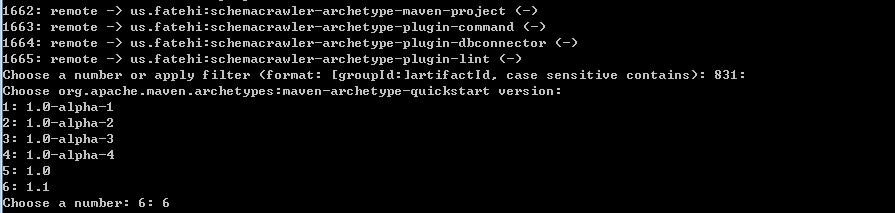
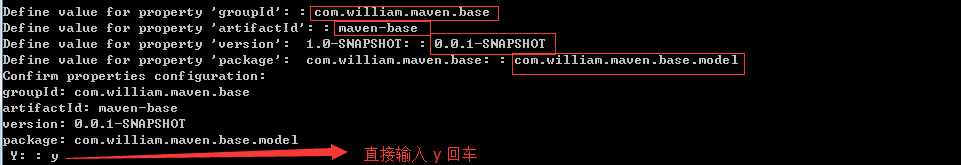

maven-study  
===============
<<<<<<< HEAD
maven 基础学习

## 生成项目命令：
1. `mvn archetype:generate`  
2. 选择项目使用的artifactId，此处默认831，即简单项目  
3. 录入项目坐标信息 

## maven 基本命令
| 命令 | 用途 |
| :-----|:----|
| mvn compile | 编译项目 		|
| mvn test    | 运行测试 		|
| mvn package | 打包    			|
| mvn clean   | 清理target目录 	|
| mvn install | 安装jar到本地仓库 |
|archetype:generate| 自动构建目录骨架：按照提示进行选择|
|archetype:generate  -Dgroupid=组织名，公司网址的反写+项目名  -DartifactId=项目-模块名  -Dversion=版本号  -Dpackage=代码所在的包名|自动构建目录骨架：一次性生成maven项目|

## maven 生命周期
- clean 清理项目
	- pre-clean 执行清理前的工作
	- clean 清理上一次构建生成的所有文件
	- post-clean 执行清理后的文件
- default 构建项目 (最核心)
	- compile test package install
- site 生成项目站点
	- pre-site 生成站点钱要完成的工作
	- site 生成项目的站点文档
	- post-site 在生成项目站点后要完成的工作
	- site-deploy 发布生成的站点到服务器上

##
##
> - **pom.xml常用给元素介绍** 
> - **依赖范围**
> - **依赖传递**
> - **依赖冲突**
> - **聚合和继承**
##
##

## pom.xml 解析
	<project xmlns="http://maven.apache.org/POM/4.0.0" xmlns:xsi="http://www.w3.org/2001/XMLSchema-instance"
		xsi:schemaLocation="http://maven.apache.org/POM/4.0.0 http://maven.apache.org/xsd/maven-4.0.0.xsd">
		<!-- 指定了当前pom的版本 -->
		<modelVersion>4.0.0</modelVersion>
	
		<groupId>com.william.maven</groupId>
		<artifactId>maven-test</artifactId>
		<!-- 第一个0表示大版本号 第二个0表示分值版本号 第三个-表示小版本号 snapshot 快照 alpha 内部测试 beta 公测 release 
			稳定 GA 正式发布 -->
		<version>0.0.1SNAPSHOT</version>
		<!-- 默认是 jar ，可选 war zip pom -->
		<packaging>jar</packaging>
	
		<!-- 项目描述名 -->
		<name>maven-test</name>
		<!-- 项目地址 -->
		<url>http://maven.apache.org</url>
		<!-- 项目描述 -->
		<description></description>
		<developers></developers>
		<organization></organization>
	
		<properties>
			<project.build.sourceEncoding>UTF-8</project.build.sourceEncoding>
		</properties>
	
		<!-- 依赖 -->
		<dependencies>
			<dependency>
				<groupId>junit</groupId>
				<artifactId>junit</artifactId>
				<version>3.8.1</version>
	
				<type></type>
				<!-- 依赖范围 -->
				<scope>test</scope>
				<!-- 设置依赖是否可选：默认false -->
				<optional></optional>
				<!-- 排除依赖 -->
				<exclusions>
					<exclusion>
						<groupId></groupId>
						<artifactId></artifactId>
					</exclusion>
				</exclusions>
			</dependency>
		</dependencies>
	
		<!-- (子模块)依赖管理 -->
		<dependencyManagement>
			<dependencies>
				<dependency></dependency>
			</dependencies>
		</dependencyManagement>
	
		<build>
			<plugins>
				<plugin></plugin>
			</plugins>
		</build>
	
		<!-- 子模块中用于对父模块的继承 -->
		<parent></parent>
		<!-- 聚合运行多个项目：可以将模块一起进行编译 -->
		<modules>
			<module></module>
		</modules>
	</project>

### 依赖传递 & 排除依赖传递：
	<dependencies>
		<dependency>
			<!-- 排除依赖 -->
			<exclusions>
				<exclusion>
					<groupId></groupId>
					<artifactId></artifactId>
				</exclusion>
			</exclusions>
		</dependency>
	</dependencies> 

### 聚合 & 继承
	<聚合> 在父 pom.xml 中， 添加如下标签:
	<modules>
		<module>trustpay-customer-web</module>
		<module>trustpay-customer-skeleton</module>
	</modules>

	<继承> 提取出一个父项目，并在父项目中管理所有依赖
	<dependencyManagement>
		<dependencies>
			<dependency>
				<groupId>org.apache.poi</groupId>
				<artifactId>poi-ooxml</artifactId>
				<version>3.10.1</version>
			</dependency>
		</dependencies>
	</dependencyManagement>

### 依赖冲突
	1. 短路优先(->表示依赖关系)
		如 项目A、B、C、D，其中 A->B->C->X1.0.jar ，而A->D->X2.0.jar
		最终，A依赖于 X2.0.jar。
		此中，A->D->X2.0.jar 这条路最短！
	2. 先声明，先优先 如果路径长度相同，则谁先声明，先解析谁
		如，A->B->X1.0.jar， 且 A->C->X2.0.jar
		在项目 A 的pom.xml中，B依赖在前，则 A依赖于 X1.0.jar
		在项目 A 的pom.xml中，C依赖在前，则 A依赖于 X2.0.jar

## 使用 maven 创建一个web项目
	1. new maven project
	2. add servlet api dependency
		1. <scope>provided</scope>	==> 只在编译和测试时运行
	3. update <project faces> with dynamic web feature
	4. delete deploy path <deployment assembly>
	5. use package command and then deploy with jetty
		1. use jetty plugin : 运行 clean package 命令
			<build>
				<finalName>webdemo</finalName>
				<plugins>
					<plugin>
						<groupId>org.mortbay.jetty</groupId>
						<artifactId>jetty-maven-plugin</artifactId>
						<version>8.1.1.v20140903</version>
						<executions>
							<execution>
								<!-- 在打包的时候，使用jetty.run来运行jetty服务 -->
								<phase>package</phase>
								<goals>
									<goal>run</goal>
								</goals>
							</execution>
						</executions>
					</plugin>
				</plugins>
			</build>
		2. use tomcat plugin : 运行 clean package 命令
			<build>
				<finalName>webdemo</finalName>
				<plugins>
					<plugin>
						<groupId>org.apache.tomcat.maven</groupId>
						<artifactId>tomcat7-maven-plugin</artifactId>
						<version>2.2</version>
						<executions>
							<execution>
								<!-- 在打包的时候，使用tomcat.run来运行jetty服务 -->
								<phase>package</phase>
								<goals>
									<goal>run</goal>
								</goals>
							</execution>
						</executions>
					</plugin>
				</plugins>
			</build>
=======
maven 学习
>>>>>>> 996df8e3311823c9a210c3ea523fac10435707de
