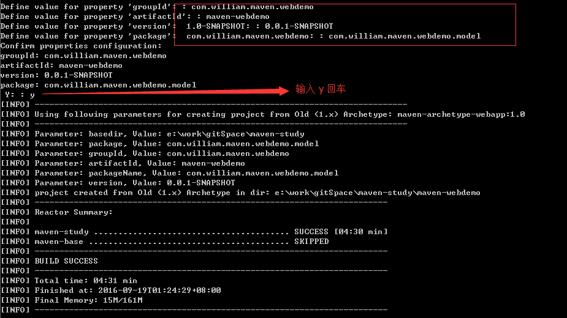

maven-webdemo
===============
利用maven构建web项目

## 生成项目命令：
	一次性命令：mvn archetype:generate -DarchetypeArtifactId=maven-archetype-webapp -DgroupId=com.william.maven.webdemo -DartifactId=maven-webdemo -DpackageName=com.william.maven.webdemo.model -Dversion=0.0.1-SNAPSHOT

1. 输入生成命令：`mvn archetype:generate`
	
2. 选择项目使用的artifactId，此处输入**834**，即maven-archetype-webapp  
	
3. 录入项目坐标信息 
	
4. 生成成功

##利用jetty/tomcat插件，运行项目
 运行命令：`mvn clean package`

	1. 利用jetty运行
	<build>
	<finalName>maven-webdemo</finalName>
	<plugins>
		<plugin>
			<groupId>org.eclipse.jetty</groupId>
			<artifactId>jetty-maven-plugin</artifactId>
			<version>9.4.0.M1</version>
			<executions>
				<execution>
					<!-- 在打包成功后，使用jetty.run 运行jetty服务 -->
					<phase>package</phase>
					<goals>
						<goal>run</goal>
					</goals>
				</execution>
			</executions>
		</plugin>
	</plugins>
	</build>
##
	2. 利用tomcat运行
	<build>
	<finalName>maven-webdemo</finalName>
	<plugins>
		<plugin>
			<groupId>org.apache.tomcat.maven</groupId>
			<artifactId>tomcat7-maven-plugin</artifactId>
			<version>2.2</version>
			<executions>
				<execution>
					<!-- 在打包成功后，使用tomcat.run 运行tomcat服务 -->
					<phase>package</phase>
					<goals>
						<goal>run</goal>
					</goals>
				</execution>
			</executions>
		</plugin>
	</plugins>
	</build>

